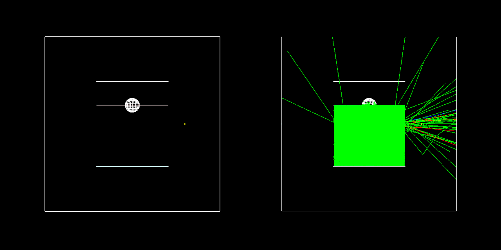

# G4BeamTest


[](https://github.com/ShiveshM/G4BeamTest/blob/master/LICENSE)

G4BeamTest is a C++ simulation of an Optical Module Beam Test at the [Fermilab
Test Beam Facility](https://ftbf.fnal.gov/) (FTBF).



## Contents
* [Optical Module Beam Test at the FTBF](#Optical-Module-Beam-Test-at-the-FTBF)
* [Installation](#Installation)
  * [Dependencies](#Dependencies)
* [Running G4BeamTest](#Running-G4BeamTest)
* [License](#License)

## <a name="Optical-Module-Beam-Test-at-the-FTBF"></a> Optical Module Beam Test at the FTBF

In this beam test, a tank was filled with distilled water, upon which an Optical Module in a glass housing was floating, observing [Cherenkov light](https://icecube.wisc.edu/science/icecube/detector) inside the tank (see below schematic). The goal was to study and confirm if pulse shape information can be used for particle identification (PID) between pions and electrons in the context of future water or ice Cherenkov [neutrino telescope experiments](https://icecube.wisc.edu/). For more details, see the paper "[*Pulse Shape Particle Identification by a Single Large Hemispherical Photo-Multiplier Tube*](https://arxiv.org/abs/1912.03901)" - S. Samani, S. Mandalia, C. Argüelles, S. Axani, Y. Li, M.H. Moulai, B. Ty, Z. Xie, J. Conrad, T. Katori, P. Sandstrom.


## <a name="Installation"></a> Installation
G4BeamTest can be installed using `cmake`
```
mkdir build && cd build
cmake -DGEANT4_USE_QT=ON ../
make
```

### <a name="Dependencies"></a> Dependencies

G4BeamTest has the following dependencies:
* [`gcc-c++`](https://gcc.gnu.org/)
* [`CMake`](https://cmake.org/) >= 2.6
* [`Geant4`](https://geant4.web.cern.ch/) >= 10.4

For installation instructions of Geant4 see the [Geant4
Installation
Guide](https://geant4-userdoc.web.cern.ch/geant4-userdoc/UsersGuides/InstallationGuide/html/).
All G4 data files including hadron cross-sections are required to be
downloaded. Here is a typical example of the environment variables which need
to be set in your `.bash_profile`:
```
export GEANTTOPDIR="/opt/geant4"
export G4LEVELGAMMADATA="$GEANTTOPDIR/share/Geant4-10.4.2/data/PhotonEvaporation5.2"
export G4NEUTRONXSDATA="$GEANTTOPDIR/share/Geant4-10.4.2/data/G4NEUTRONXS1.4"
export G4LEDATA="$GEANTTOPDIR/share/Geant4-10.4.2/data/G4EMLOW7.3"
export G4NEUTRONHPDATA="$GEANTTOPDIR/share/Geant4-10.4.2/data/G4NDL4.5"
export G4ENSDFSTATEDATA="$GEANTTOPDIR/share/Geant4-10.4.2/data/G4ENSDFSTATE2.2"
export G4RADIOACTIVEDATA="$GEANTTOPDIR/share/Geant4-10.4.2/data/RadioactiveDecay5.2"
export G4ABLADATA="$GEANTTOPDIR/share/Geant4-10.4.2/data/G4ABLA3.1"
export G4PIIDATA="$GEANTTOPDIR/share/Geant4-10.4.2/data/G4PII1.3"
export G4SAIDXSDATA="$GEANTTOPDIR/share/Geant4-10.4.2/data/G4SAIDDATA1.1"
export G4REALSURFACEDATA="$GEANTTOPDIR/share/Geant4-10.4.2/data/RealSurface2.1.1"
export LD_LIBRARY_PATH=$GEANTTOPDIR/lib64:$LD_LIBRARY_PATH
export PATH=$GEANTTOPDIR/bin:$PATH
```

Additional dependencies:
* [`Qt`](https://www.qt.io/) >= 4

Be sure to install with `Qt` support for the GUI interface shown in the
image above.

## <a name="Running-G4BeamTest"></a> Running G4BeamTest

To test the installation is working, run the test macro `run1.mac`, which will
generate 10 electrons with an energy of 2 GeV and fire them into the tank. In
the `build` folder, run
```
./G4BeamTest -m run1.mac -n test_2GeV_e.txt
```
For each electron, if it manages to pass through the tank and is detected in
the downstream scintillator (SC4), the number of Cherenkov photons that hit the
underside of the Optical Module glass shell is recorded in the output file
specified by the `-n` flag.

To run with the GUI `Qt` application simply run
```
./G4BeamTest
```

## <a name="License"></a> License

[MIT License](LICENSE)

Copyright (c) 2020 Shivesh Mandalia
